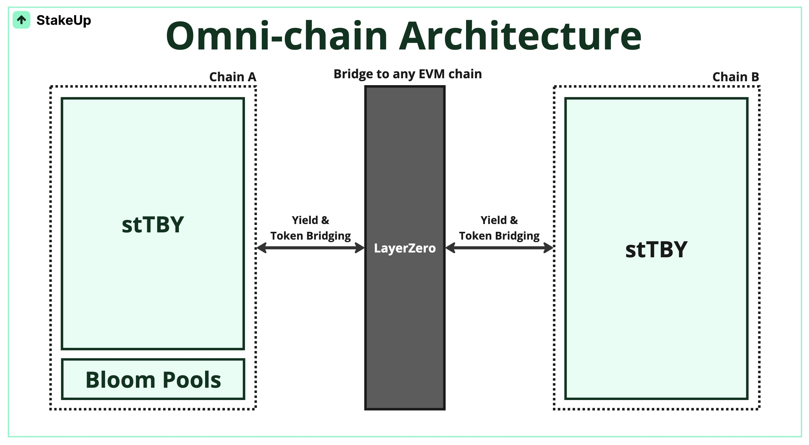

# Staked USDC (stUSDC)

## Repo Setup

1. Install the dependencies

```bash
yarn
```

2. Compile the contracts

```bash
yarn build
```

3. Run the tests

```bash
yarn test
```

## Overview

stTBY is an omnichain stablecoin backed by receipt tokens called TBYs. TBYs, a product of Bloom Protocol, are a corporate debt token denominated in USDC and are over-collateralized with Backed Finances bib01 tracker certificate.

TBYs are limited due to users being subject to the 6-month fixed term lockup of the asset and that new TBYs are minted every two weeks as a different ERC-20, thus making it difficult to integrate into DeFi protocols.

## How stUsdc Solves This Problem

stUsdc solves TBYs composability issues by allowing users to deposit their TBYs or USDC into the contract and receive stUsdc in return. stUsdc can be thought of as an index of active TBYs in the market. As new Bloom Pool mint occur every two weeks, the stUsdc contract will automatically redeposit all underlying funds into the new TBYs, allowing users to hold stUsdc without the need of actively managing their various TBY batches. This token follows a rebasing mechanism that automates TBY's to stUsdc holders.

## Design




### Tokens

- **stUsdc**: The stUsdc token is the main token of the protocol. It is a rebasing token that tracks the underlying TBY. It is minted when users deposit TBYs or USDC into the contract and burned when users withdraw their USDC. This token rebases using a hybrid system. Maintenance rebases occur every transaction, while yield rebases are triggered every 24-hours, via cross-referencing BloomPool's `getRate` function.

- **wstUsdc**: Wrapped stUsdc is the wrapped asset of `stUsdc`. It is non-rebasing, allowing users to access the underlying value of their stUsdc and be more useable in DeFi.

- **StakupToken**: StakeUp Token (SUP), is the reward token of the StakeUp Protocol.

- **SUPVesting**: SUPVesting is a vesting contract that locks up SUP tokens during predefined vesting schedules. Its purpose is to manage the distribution of SUP tokens to contributors and investors of the StakeUp Protocol and stUsdc. These tokens are considered staked on the StakeUp Protocol and allow users to generate rewards even while locked under vesting schedules.

### Staking

- **StakeUpStaking**: StakeUp Staking is the heart of the reward system for stUsdc. It allows users to stake their SUP to access the reward system of the protocol. `stUsdc` from fees are sent to the contract and is used to generate yield for the users of the protocol. Additionally it manage the distribution of SUP tokens to contributors and investors of the StakeUp Protocol and stUsdc. These tokens are considered staked on the StakeUp Protocol and allow users to generate rewards even while locked under vesting schedules. 

Below is the outline of the fee mechanism of stUsdc.
  - Performance Fees: 10% of TBY yield

### Rewards

- **CurveGaugeDistributor**: The `CurveGaugeDistributor`, a feature of the `RewardManger` deploys CurveGauges and sends weekly emissions to the rewards gauges that are distributed to liquidity provider in the form of swap fees. Below is an outline of the liquidity pools eligible for rewards.

  - stUsdc/3CRV
  - wstUsdc/wstETH
  - wstUsdc/CHAI
  - stUsdc/SUP